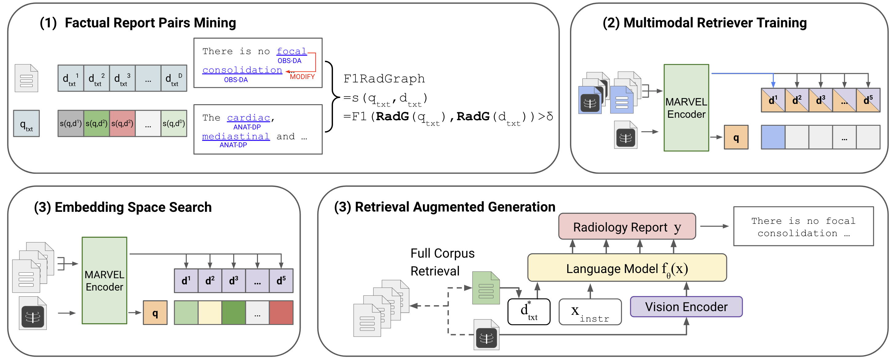

# [NAACL 2025] FactMM-RAG: Fact-Aware Multimodal Retrieval Augmentation for Accurate Medical Radiology Report Generation
In this work, we present FactMM-RAG, a fact-aware multimodal retrieval-augmented pipeline for generating accurate radiology reports. [[Paper Link](https://arxiv.org/abs/2407.15268)]



## 📅 Schedule

- [x] Release the data preprocessing code
- [ ] Release the factual report pair mining code
- [ ] Release the retriever training code
- [ ] Release the generator training code


## 📦 Requirements
1. Clone this repository and navigate to FactMM-RAG folder
```bash
git clone https://github.com/cxcscmu/FactMM-RAG.git
cd FactMM-RAG
```

2. Install Package: Create conda environment

```Shell
conda create -n FactMM-RAG python=3.10 -y
conda activate FactMM-RAG
pip install -r requirements.txt
```

3. Download the required dataset and checkpoint
   - Dataset: [MIMIC-CXR](https://vilmedic.app/papers/acl2023/) and [CheXpert](https://stanfordaimi.azurewebsites.net/datasets/8cbd9ed4-2eb9-4565-affc-111cf4f7ebe2)
   - Checkpoint: [MARVEL](https://huggingface.co/OpenMatch/marvel-ance-clueweb/tree/main)

## 📖 Data Preprocessing
1. Place the downloaded datasets in `./data/mimic` and `./data/chexpert`. We follow the official splitting and parse them into train, valid, and train files. To process the radiology dataset and generate the output JSON file, run the following command (e.g. train file parsing):
```sh
python ./data/parse.py --image_paths_file ./data/mimic/train.image.tok \
                 --findings_file ./data/mimic/train.findings.tok \
                 --impressions_file ./data/mimic/train.impression.tok \
                 --output_json_file ./data/mimic/train.json
```
2. Annotate reports with radiological entities, clinical relations, and diagnostic labels using RadGraph and CheXbert:
```sh
python ./data/label.py --input_path ./data/mimic/train.json \
                --output_path ./data/mimic/train_labeled.json \
                --device cuda   
```
## 📚Citation

```bibtex
@misc{sun2025factawaremultimodalretrievalaugmentation,
      title={Fact-Aware Multimodal Retrieval Augmentation for Accurate Medical Radiology Report Generation}, 
      author={Liwen Sun and James Zhao and Megan Han and Chenyan Xiong},
      year={2025},
      eprint={2407.15268},
      archivePrefix={arXiv},
      primaryClass={cs.CL},
      url={https://arxiv.org/abs/2407.15268}, 
}
```

## 🙏Acknowledgement
We use code from [LLaVA](https://github.com/haotian-liu/LLaVA) and [MARVEL](https://github.com/OpenMatch/MARVEL). We thank the authors for releasing their code.